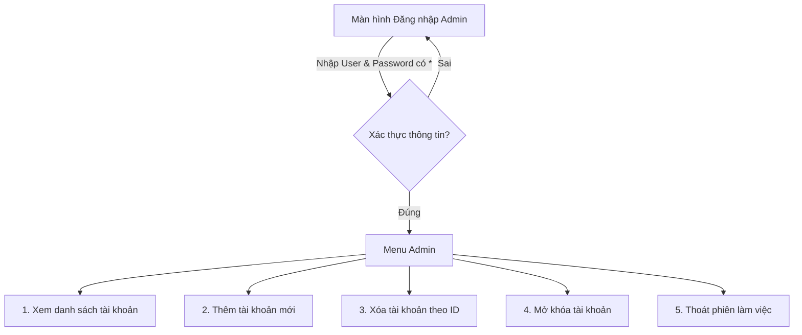
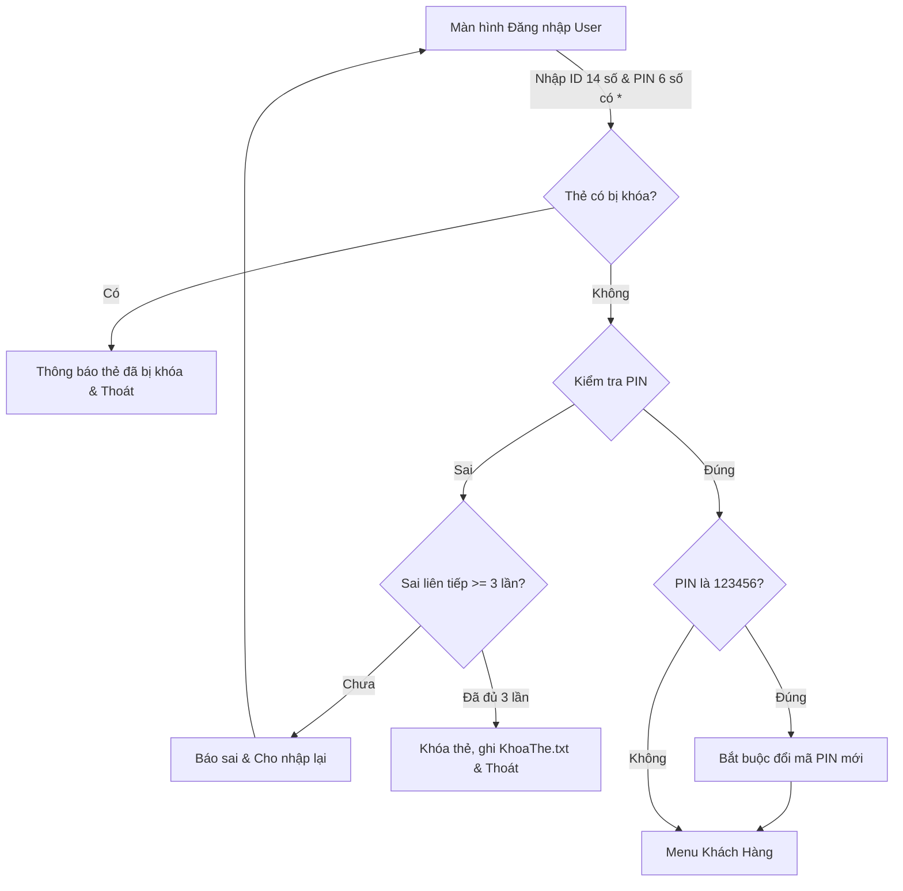

# 02. YÊU CẦU & PHẠM VI DỰ ÁN (PROJECT SCOPE & REQUIREMENTS)

Tài liệu này xác định chi tiết phạm vi thực hiện, các yêu cầu chức năng, yêu cầu lưu trữ và các quy tắc nghiệp vụ bắt buộc của **Project 1: Mô phỏng hệ thống máy ATM**.

---

## I. PHẠM VI DỰ ÁN (PROJECT SCOPE)

### 1. Mục tiêu tổng quát
Xây dựng ứng dụng dòng lệnh (Console/CLI) trên nền tảng **C++** nhằm mô phỏng quy trình giao dịch tại máy rút tiền tự động (ATM), hỗ trợ phân quyền người dùng (Admin và User), lưu trữ trạng thái bền vững trên hệ thống tệp tin và ứng dụng cấu trúc dữ liệu tự cài đặt (Generic Template).

### 2. Các thành phần trong phạm vi (In-Scope)
* **Phân quyền người dùng**: Tách biệt luồng nghiệp vụ giữa Quản trị viên (Admin) và Chủ thẻ (User).
* **Lưu trữ dữ liệu dạng Tệp tin văn bản (Flat File)**: Đọc, ghi, cập nhật, xóa dữ liệu trên các tệp `.txt` mà không sử dụng cơ sở dữ liệu quan hệ (RDBMS).
* **Cấu trúc dữ liệu tự định nghĩa**: Cài đặt lớp mẫu Generic Template `LinkedList<T>` để nạp và quản lý toàn bộ dữ liệu trong bộ nhớ động (RAM) khi chạy ứng dụng.
* **Bảo mật giao diện Console**: Che giấu mật khẩu và mã PIN bằng ký tự `*`, hỗ trợ xóa lùi phím Backspace.
* **Trải nghiệm giao diện dòng lệnh (CLI)**: Sử dụng mã màu chuẩn ANSI Color, phân chia khung menu trực quan theo mẫu giao diện trong đề bài.

### 3. Các thành phần ngoài phạm vi (Out-of-Scope)
* Không tích hợp phần cứng máy ATM thực tế (khay nhả tiền mặt, đầu đọc dải từ / chip thẻ).
* Không hỗ trợ kết nối mạng phân tán Client-Server (ứng dụng chạy cục bộ Single-instance).
* Không phát triển giao diện đồ họa người dùng (GUI) qua Qt/GTK/WinForms.
* Không áp dụng các thuật toán mã hóa băm mật khẩu một chiều phức tạp (như Bcrypt, SHA-256) do đề bài yêu cầu lưu trữ plain text trong các tệp quy định.

---

## II. YÊU CẦU LƯU TRỮ DỮ LIỆU (DATA STORAGE SPECIFICATIONS)

Hệ thống bắt buộc phải duy trì tính toàn vẹn và đồng bộ cho các tệp tin lưu trữ sau:

| Tên tệp tin | Cấu trúc nội dung | Ràng buộc số lượng & Quy cách |
| :--- | :--- | :--- |
| **`Admin.txt`** | Mỗi dòng chứa: `user pass` (phân cách bằng dấu cách). | Tối thiểu **3 tài khoản Admin** khởi tạo sẵn. |
| **`TheTu.txt`** | Mỗi dòng chứa 2 trường: • `Mã số tài khoản (ID)`: chuỗi đúng 14 chữ số. • `Mã PIN`: chuỗi đúng 6 chữ số. | Tối thiểu **10 thẻ từ** ban đầu. Được cập nhật khi thêm thẻ, xóa thẻ, đổi PIN. |
| **`[ID].txt`** *(vd: `10014504501111.txt`)* | Thông tin tài khoản (4 dòng riêng biệt): • Dòng 1: ID tài khoản (14 chữ số) • Dòng 2: Họ và tên chủ thẻ (ví dụ: `Nguyen Trung Kien`) • Dòng 3: Số dư khả dụng (ví dụ: `100000`) • Dòng 4: Đơn vị tiền tệ (ví dụ: `VND`) | Mỗi thẻ trong `TheTu.txt` bắt buộc phải có 1 file thông tin tương ứng. Bị xóa khi Admin xóa thẻ. |
| **`[LichSuID].txt`** *(vd: `LichSu10014504501111.txt`)* | Ghi nhận chi tiết từng giao dịch theo định dạng chuẩn: `ID | Loại GD | Số tiền | Thời gian | Chi tiết` | Tự động tạo khi thêm thẻ mới. Giữ lại dữ liệu ngay cả khi tài khoản bị xóa (để tra soát kiểm toán). |
| **`KhoaThe.txt`** | Danh sách các ID thẻ đang bị khóa do nhập sai PIN 3 lần liên tiếp. | Đảm bảo thẻ bị khóa vẫn duy trì trạng thái kể cả khi tắt và bật lại chương trình. |

---

## III. YÊU CẦU CHỨC NĂNG (FUNCTIONAL REQUIREMENTS)

### 1. Phân hệ Quản trị viên (Admin Module)

* **Đăng nhập Admin**:
  * Kiểm tra tài khoản `user` và `pass` có tồn tại trong `Admin.txt`.
  * Mật khẩu hiển thị dưới dạng dấu `*` khi nhập.
* **Chức năng Admin**:
  1. **Xem danh sách tài khoản**: Hiển thị toàn bộ dữ liệu thẻ từ đang lưu trong `TheTu.txt` (ID, mã PIN hoặc trạng thái thẻ).
  2. **Thêm tài khoản**:
     * Nhập ID mới: Phải đúng 14 chữ số và **chưa từng tồn tại** trong hệ thống.
     * Mã PIN tự động gán mặc định là `123456`.
     * Nhập tên chủ tài khoản, số dư nạp ban đầu, loại tiền tệ.
     * Tự động sinh tệp `[ID].txt` và `[LichSuID].txt`.
     * Tự động cập nhật thêm dòng mới vào file `TheTu.txt`.
  3. **Xóa thẻ**:
     * Nhập ID thẻ cần xóa.
     * Xác nhận yêu cầu xóa từ Admin.
     * Xóa thẻ khỏi danh sách bộ nhớ và cập nhật lại `TheTu.txt`.
     * Xóa tệp thông tin tài khoản `[ID].txt` tương ứng. Tệp lịch sử giao dịch được giữ lại.
  4. **Mở khóa tài khoản**:
     * Hiển thị danh sách các tài khoản đang bị khóa do nhập sai quá 3 lần.
     * Cho phép Admin chọn ID để mở khóa, xóa ID khỏi `KhoaThe.txt` và đặt lại số lần nhập sai về 0.
  5. **Thoát**: Đăng xuất an toàn về Menu điều hướng chính.

---

### 2. Phân hệ Khách hàng (User Module)

* **Đăng nhập User & Ràng buộc bảo mật**:
  * Nhập ID gồm 14 chữ số và PIN gồm 6 chữ số (mã hóa dấu `*`).
  * Nếu thẻ nằm trong danh sách khóa: Từ chối đăng nhập ngay lập tức.
  * Nếu nhập sai PIN: Đếm số lần sai. Khi **sai quá 3 lần liên tiếp**, hệ thống tự động khóa thẻ, lưu vết vào `KhoaThe.txt` và thoát chương trình.
  * Nếu đăng nhập lần đầu (mã PIN hiện tại là `123456`): Hệ thống bắt buộc đổi mã PIN mới trước khi cho phép vào Menu chính. Mã mới phải khác mã cũ.
* **Menu chức năng Khách hàng**:
  1. **Xem thông tin tài khoản**: Đọc và hiển thị ID, Họ tên, Số dư và Loại tiền tệ từ file `[ID].txt`.
  2. **Rút tiền**:
     * Nhập số tiền muốn rút.
     * Xác nhận giao dịch trước khi thực hiện.
     * Kiểm tra các ràng buộc nghiệp vụ tài chính.
     * Trừ tiền và cập nhật trực tiếp vào file `[ID].txt`.
     * Ghi nhận dòng lịch sử rút tiền vào `[LichSuID].txt`.
  3. **Chuyển tiền**:
     * Nhập số tài khoản thụ hưởng (ID người nhận) và số tiền muốn chuyển.
     * Kiểm tra tài khoản nhận: Phải tồn tại trong hệ thống và khác tài khoản của người gửi.
     * Hiển thị tên chủ tài khoản nhận để người gửi xác nhận chuyển tiền.
     * Thực hiện giao dịch nguyên tử: Trừ tiền người gửi, cộng tiền người nhận trong các file `[ID].txt` tương ứng.
     * Ghi lịch sử giao dịch ở cả 2 phía:
       * File người gửi `[LichSuID_gui].txt`: Ghi nhận "Chuyển tiền đến [ID_nhận] - [Tên] - Số tiền - Thời gian".
       * File người nhận `[LichSuID_nhan].txt`: Ghi nhận "Nhận tiền từ [ID_gửi] - [Tên] - Số tiền - Thời gian".
  4. **Xem nội dung giao dịch**: Đọc toàn bộ nội dung từ file `[LichSuID].txt` và hiển thị dưới dạng bảng rõ ràng.
  5. **Đổi mã PIN**:
     * Yêu cầu nhập lại mã PIN cũ để xác thực.
     * Yêu cầu nhập mã PIN mới 2 lần để đối soát.
     * Ràng buộc: Mã PIN mới gồm đúng 6 chữ số, khác mã PIN cũ và khác mã mặc định `123456`.
     * Cập nhật mã PIN mới vào tệp `TheTu.txt`.
  6. **Thoát**: Trả thẻ, hủy phiên làm việc an toàn.

---

## IV. CÁC RÀNG BUỘC NGHIỆP VỤ BẮT BUỘC (BUSINESS RULES)

1. **Ràng buộc số tiền giao dịch**:
   * Số tiền rút/chuyển tối thiểu: $\ge 50.000$ VNĐ.
   * Số tiền rút/chuyển phải là **bội số của 50.000 VNĐ** (ví dụ: 50.000, 100.000, 150.000, 500.000...).
   * **Số dư tối thiểu cần duy trì**: Tài khoản luôn phải giữ lại ít nhất 50.000 VNĐ. Tức là:
     $$\text{Số tiền giao dịch} \le \text{Số dư hiện tại} - 50.000\text{ VNĐ}$$
   * Nếu người dùng nhập sai: Báo lỗi chi tiết bằng màu sắc và cho phép nhập lại.
2. **Ràng buộc chuỗi định danh**:
   * ID tài khoản: Đúng 14 ký tự số (`^[0-9]{14}$`).
   * Mã PIN: Đúng 6 ký tự số (`^[0-9]{6}$`).
3. **Tính nguyên tử của giao dịch chuyển tiền (Atomicity)**:
   * Nếu một trong hai tài khoản gặp sự cố (ví dụ lỗi I/O tệp tin), giao dịch phải bị hủy toàn phần, số dư của cả hai tài khoản được giữ nguyên vẹn.
4. **Phục hồi và Khởi tạo tự động (Auto-Recovery)**:
   * Khi khởi động chương trình, nếu thư mục dữ liệu hoặc các tệp tin cơ sở (`Admin.txt`, `TheTu.txt`) chưa tồn tại, hệ thống phải tự động tạo thư mục và sinh dữ liệu mẫu ban đầu để không gây crash ứng dụng.
