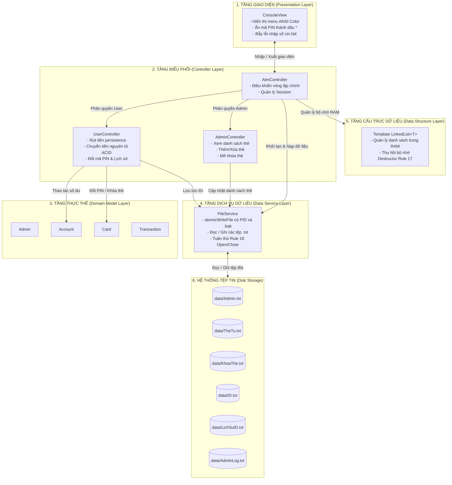

# 03. KIẾN TRÚC HỆ THỐNG (SYSTEM ARCHITECTURE)

---

## I. MÔ HÌNH KIẾN TRÚC PHÂN TẦNG (LAYERED ARCHITECTURE)

Hệ thống được thiết kế theo mô hình kiến trúc phân tầng (Layered Architecture) nhằm đảm bảo tính độc lập giữa Giao diện (Presentation), Điều phối nghiệp vụ (Controllers), Thực thể dữ liệu (Domain Models), Dịch vụ tệp tin (Data Service) và Cấu trúc dữ liệu tự cài đặt (Data Structure Foundation).



---

## II. CHI TIẾT CÁC TẦNG CHỨC NĂNG

### 1. Tầng Giao diện (Presentation Layer - `ConsoleView`)

- **Nhiệm vụ**: Đảm nhận toàn bộ tương tác nhập/xuất trên màn hình console.
- **Đặc điểm**:
  - Không chứa logic tính toán tiền bạc hay kiểm tra nghiệp vụ.
  - Hỗ trợ bắt phím thời gian thực bằng `_getch()` (trên Windows) hoặc lớp RAII `LinuxTerminalRawGuard` (trên Linux) để in dấu `*` bảo mật.
  - Tích hợp mã màu ANSI chuẩn (đỏ cho lỗi, xanh lá cho thành công, vàng cho cảnh báo, cyan cho bảng biểu).
  - Giới hạn độ dài nhập liệu tối đa 32 ký tự, ngăn chặn tấn công tràn bộ đệm console DoS.
  - Bộ lọc `cin.fail()` và bắt tín hiệu `EOF` (`Ctrl+D`) ngăn chặn triệt để lỗi sập chương trình hoặc treo CPU 100%.

### 2. Tầng Điều phối (Controller Layer - `AtmController`, `UserController`, `AdminController`)

- **Nhiệm vụ**: Trung tâm điều khiển toàn bộ luồng xử lý và phân quyền của hệ thống.
- **Các thành phần**:
  - `AtmController`: Bộ điều phối trung tâm, khởi tạo ứng dụng, quản lý phiên làm việc (`_pCurrentAccount`, `_pCurrentCard`, `_eCurrentRole`) và giải phóng bộ nhớ khi đăng xuất.
  - `UserController`: Xử lý toàn bộ nghiệp vụ khách hàng gồm đăng nhập, ép đổi mã PIN mặc định lần đầu, rút tiền có kiểm tra hạn mức, chuyển tiền nguyên tử hai đầu và xem lịch sử giao dịch phân trang.
  - `AdminController`: Xử lý phân hệ quản trị viên gồm xem danh sách thẻ kèm trạng thái mở/khóa, thêm thẻ mới (tạo đủ 2 file trên đĩa), xóa thẻ an toàn có cảnh báo số dư và mở khóa thẻ bị khóa do nhập sai PIN.

### 3. Tầng Thực thể (Domain Model Layer)

- **Nhiệm vụ**: Đại diện cho các đối tượng nghiệp vụ cốt lõi trong hệ thống:
  - `Admin`: Lưu thông tin đăng nhập quản trị viên, hàm `verifyPassword()`.
  - `Card`: Lưu mã số thẻ (14 số), mã PIN (6 số), trạng thái khóa, số lần nhập sai.
  - `Account`: Lưu ID, họ tên chủ thẻ, số dư hiện tại, loại tiền tệ (`VND`, `USD`).
  - `Transaction`: Lưu vết chi tiết một giao dịch (loại giao dịch, số tiền, mốc thời gian thực, mô tả).
- **Đặc điểm**: Tuân thủ chuẩn OOP đóng gói (Encapsulation), toàn bộ thuộc tính là `private` có tiền tố `_`, truy xuất thông qua các hàm Getter/Setter có từ khóa `const`.

### 4. Tầng Dịch vụ Tệp tin (Data Service Layer - `FileService`)

- **Nhiệm vụ**: Đảm bảo việc đọc và ghi dữ liệu ra hệ thống tệp tin vật lý trên đĩa.
- **Đặc điểm**:
  - Toàn bộ phương thức là `static`.
  - Cơ chế **Ghi tệp nguyên tử (Atomic Write)** qua tệp tạm `.tmp.<PID>` và `rename` kết hợp tệp sao lưu `.bak`, triệt tiêu rủi ro mất dữ liệu khi mất nguồn hoặc xung đột tiến trình.
  - Tuyệt đối không mở file ở một hàm mà đóng file ở hàm khác (tuân thủ Rule 18 của Coding Standard).
  - Truyền danh sách `LinkedList<T>&` qua tham chiếu để tránh rò rỉ bộ nhớ hoặc lỗi copy nông.
  - Tự động lưu trữ (Archive) tệp lịch sử khi tái tạo thẻ cũ nhằm bảo vệ quyền riêng tư.

### 5. Tầng Cấu trúc Dữ liệu (Foundation Layer - `LinkedList<T>`)

- **Nhiệm vụ**: Cung cấp cấu trúc danh sách liên kết tự tạo dạng Generic Template độc lập.
- **Đặc điểm**:
  - Quản lý hai con trỏ `_pHead` và `_pTail`, giúp thao tác thêm cuối `addTail()` đạt độ phức tạp tối ưu $\mathcal{O}(1)$.
  - Tự quản lý cấp phát động bằng `new` và giải phóng toàn bộ node bằng `delete` trong Destructor (tuân thủ Rule 17).
  - Vô hiệu hóa Copy Constructor và Copy Assignment Operator (`= delete`) để loại bỏ hoàn toàn lỗi sao chép nông gây Double Free.
  - Thay thế hoàn toàn cho `std::vector` hoặc `std::list` của STL.

---

## III. CƠ CHẾ BẢO VỆ & XỬ LÝ NGOẠI LỆ

1. **Bảo vệ Luồng Nhập liệu (Input Stream Protection)**:
   - Mọi hàm nhập số (Số tiền, Lựa chọn Menu) đều được bọc trong vòng lặp kiểm tra trạng thái luồng nhập. Nếu xảy ra lỗi ép kiểu hoặc ký tự không hợp lệ, hệ thống lập tức gọi `cin.clear()` và `cin.ignore()` để dọn sạch bộ đệm.
2. **Cô lập Phiên làm việc (Session Isolation)**:
   - Dữ liệu tài khoản của người dùng chỉ được tải vào con trỏ `Account* _pCurrentAccount` đúng thời điểm đăng nhập thành công. Khi chọn Thoát hoặc giao dịch hoàn tất, con trỏ được giải phóng (`delete`) và gán về `nullptr`.
3. **Tự động Phục hồi Cấu trúc Tệp (Auto-Recovery)**:
   - Khi khởi động, nếu hệ thống không tìm thấy thư mục `data/` hoặc các tệp tin cơ sở (`Admin.txt`, `TheTu.txt`), phương thức `FileService::initSampleData()` sẽ tự động tạo thư mục và sinh dữ liệu mẫu ban đầu kèm tệp đánh dấu `.system_initialized`.
4. **Bảo toàn Tính Nguyên tử (ACID Rollback)**:
   - Trong giao dịch chuyển tiền hai chiều, nếu thao tác ghi số dư người nhận gặp sự cố, hệ thống tự động hoàn tiền lại nguyên vẹn cho người gửi và hủy giao dịch an toàn.

---

## IV. CẤU TRÚC THƯ MỤC NGUỒN (DIRECTORY STRUCTURE)

```
DataStructure_ATM-Project/
├── Makefile                          # Script biên dịch tự động (g++ -std=c++17 -Wall -Wextra)
├── run.sh                            # Script tự động hóa cho Linux / macOS (hỗ trợ có hoặc không có make)
├── run.bat                           # Script tự động hóa cho Windows (thực thi trực tiếp qua g++)
├── atm_project.exe                   # Tệp thực thi nhị phân biên dịch sẵn
├── README.md                         # Giới thiệu tổng quan repository
├── CHANGELOG.md                      # Nhật ký chi tiết phiên bản và phân công đóng góp
├── Project/                          # Đề bài và biểu mẫu đồ án từ nhà trường
│   ├── Đề Bài.pdf
│   ├── Yêu cầu thực hiện Project.pdf
│   ├── Tài Liệu Đọc.pdf             # Quy chuẩn C++ Coding Standard V2
│   └── Mau_BaoCao_DoAn.docx
├── data/                             # Thư mục cơ sở dữ liệu tệp tin (.txt)
│   ├── Admin.txt                     # Danh sách tài khoản quản trị
│   ├── TheTu.txt                     # Danh sách thẻ từ (ID 14 số và mã PIN)
│   ├── KhoaThe.txt                   # Danh sách ID thẻ bị khóa
│   ├── [ID].txt                      # Tệp chi tiết từng tài khoản (ID, Tên, Số dư, Tiền tệ)
│   ├── LichSu[ID].txt                # Nhật ký biến động số dư theo thời gian thực
│   └── AdminLog.txt                  # Nhật ký kiểm toán thao tác quản trị
├── docs/                             # Hệ thống tài liệu kỹ thuật chi tiết
│   ├── TIEN_DO_CONG_VIEC.md          # Bảng theo dõi tiến độ công việc (Task Tracker)
│   ├── DemoScript_User.md            # Kịch bản demo phân hệ User (Member A)
│   ├── 01_tieu_chi_cham.md           # Thang điểm chi tiết và các bẫy kỹ thuật C++
│   ├── 02_yeu_cau_va_pham_vi.md      # Phạm vi nghiệp vụ và đặc tả yêu cầu
│   ├── 03_kien_truc_he_thong.md      # Kiến trúc phân tầng Layered Architecture
│   ├── 04_ctdl_va_thuat_toan.md      # Thiết kế Template LinkedList và phân tích Big-O
│   ├── 05_thiet_ke_chi_tiet.md       # Thiết kế chi tiết từng Class và Method
│   ├── 06_ke_hoach_trien_khai.md     # Phân công công việc và lộ trình 14 ngày
│   ├── 07_ke_hoach_kiem_thu.md       # Kế hoạch kiểm thử và ma trận test cases
│   └── 08_so_do_uml_va_luong_du_lieu.md # Sơ đồ UML Class, DFD và Sequence Diagram
├── include/                          # Tệp tin Header (*.h)
│   ├── Common.h                      # Hằng số, Enum, ErrorCode dùng chung
│   ├── LinkedList.h                  # Template Class Cấu trúc dữ liệu tự tạo
│   ├── Admin.h                       # Khai báo lớp Admin
│   ├── Card.h                        # Khai báo lớp Card
│   ├── Account.h                     # Khai báo lớp Account
│   ├── Transaction.h                 # Khai báo lớp Transaction
│   ├── FileService.h                 # Dịch vụ thao tác tệp tin vật lý
│   ├── ConsoleView.h                 # Tiện ích giao diện Console và ANSI UX
│   ├── AdminController.h             # Bộ điều phối Phân hệ Quản trị Admin
│   ├── UserController.h              # Bộ điều phối Phân hệ Khách hàng User
│   └── AtmController.h               # Bộ điều phối trung tâm ứng dụng
├── src/                              # Tệp tin Hiện thực (*.cpp)
│   ├── Admin.cpp
│   ├── Card.cpp
│   ├── Account.cpp
│   ├── Transaction.cpp
│   ├── FileService.cpp
│   ├── ConsoleView.cpp
│   ├── AdminController.cpp
│   ├── UserController.cpp
│   ├── AtmController.cpp
│   └── main.cpp                      # Điểm vào chính của chương trình
├── test/                             # Toàn bộ mã nguồn kiểm thử tự động
│   ├── test.cpp                      # Test suite tổng hợp
│   ├── test_member_a.cpp             # Test Unit Member A (Phase 1)
│   ├── test_member_c.cpp             # Test Unit Member C (Phase 1)
│   ├── test_phase_1_AC.cpp           # Test tích hợp Member A và C (Phase 1)
│   ├── test_phase_2_a.cpp            # Test Member A (Phase 2)
│   ├── test_phase_2_b.cpp            # Test Member B (Phase 2)
│   ├── test_phase_2_c.cpp            # Test Member C (Phase 2)
│   ├── test_phase_3.cpp              # Test tích hợp toàn trình (Phase 3)
│   ├── test_phase_3_a.cpp            # Test nghiệp vụ User và Giao dịch (Phase 3 Member A)
│   └── test_memory_leak.cpp          # Kiểm định rò rỉ bộ nhớ (Phase 4 Member B)
└── scripts/                          # Kịch bản tự động hóa
    └── valgrind_check.sh             # Script kiểm tra Valgrind Memcheck
```

---

## V. ĐỊNH HƯỚNG MỞ RỘNG (EXTENSIBILITY)

1. **Tích hợp Tỷ giá Ngoại tệ Tự động (Exchange Rate Service)**:
   - Hệ thống hiện tại đã hỗ trợ lưu trữ và xử lý đa tiền tệ (`VND` và `USD`). Trong các giai đoạn phát triển tiếp theo, có thể bổ sung module `ExchangeRateService` tích hợp API ngân hàng trực tuyến để tự động quy đổi tỷ giá thời gian thực khi thực hiện chuyển tiền liên tiền tệ.
2. **Nâng cấp Hệ Quản trị Cơ sở Dữ liệu (Database Migration)**:
   - Tầng lưu trữ hiện tại được trừu tượng hóa hoàn toàn qua `FileService`. Trong tương lai, việc chuyển dịch từ cơ sở dữ liệu tệp phẳng (.txt) sang hệ quản trị cơ sở dữ liệu quan hệ (SQLite, PostgreSQL) chỉ cần triển khai lại các phương thức trong `FileService` mà hoàn toàn không ảnh hưởng đến tầng nghiệp vụ (Controllers) hay giao diện (Presentation).
3. **Phát triển Giao diện Đồ họa (GUI Client)**:
   - Nhờ kiến trúc phân tầng độc lập tuyệt đối, tầng `ConsoleView` có thể được thay thế hoặc bổ sung bằng ứng dụng đồ họa (Qt C++ hoặc Web API) mà giữ nguyên 100% mã nguồn của Tầng Thực thể và Tầng Điều phối.
