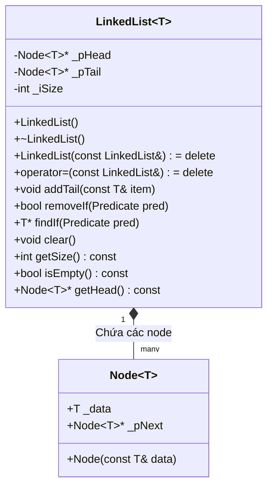

# 04. CẤU TRÚC DỮ LIỆU & THUẬT TOÁN (DATA STRUCTURES & ALGORITHMS)

---

## I. THIẾT KẾ GENERIC TEMPLATE `LinkedList<T>`

Để đạt trọn vẹn điểm số về mặt Cấu trúc dữ liệu & Template (2.0 điểm), hệ thống không sử dụng các container có sẵn của thư viện chuẩn STL (như `std::vector`, `std::list`) mà tự xây dựng lớp mẫu Danh sách liên kết đơn có con trỏ đuôi:



### 1. Thành phần cấu tạo:

- **Struct `Node<T>`**:
  - `T _data`: Chứa dữ liệu của phần tử (đối tượng `Admin`, `Card`, `Transaction`, `string`).
  - `Node<T>* _pNext`: Con trỏ trỏ đến nút kế tiếp trong chuỗi liên kết (khởi tạo bằng `nullptr`).
- **Class `LinkedList<T>`**:
  - `Node<T>* _pHead`: Con trỏ quản lý nút đầu tiên của danh sách.
  - `Node<T>* _pTail`: Con trỏ quản lý nút cuối cùng của danh sách (giúp thao tác thêm cuối đạt độ phức tạp tối ưu $\mathcal{O}(1)$).
  - `int _iSize`: Biến đếm số lượng phần tử hiện hành (tuân thủ Hungarian Notation với tiền tố `_i`).

---

## II. ỨNG DỤNG CẤU TRÚC DỮ LIỆU TRONG HỆ THỐNG

Lớp khuôn mẫu `LinkedList<T>` được cụ thể hóa (instantiate) cho các đối tượng nghiệp vụ trong ứng dụng:

1. **`LinkedList<Admin>`**: Nạp toàn bộ thông tin đăng nhập của ban quản trị từ file `Admin.txt` vào RAM lúc khởi động hệ thống.
2. **`LinkedList<Card>`**: Nạp toàn bộ thẻ từ từ `TheTu.txt` vào bộ nhớ để phục vụ thao tác xác thực đăng nhập, kiểm tra sự tồn tại của số tài khoản người nhận khi chuyển tiền.
3. **`LinkedList<string>`**: Lưu trữ danh sách các mã ID thẻ đang bị khóa từ `KhoaThe.txt` để Admin duyệt và mở khóa nhanh chóng.
4. **`LinkedList<Transaction>`**: Nạp toàn bộ lịch sử giao dịch từ file `[LichSuID].txt` của người dùng hiện tại để hiển thị bảng sao kê trên giao diện console.

---

## III. QUẢN LÝ TÀI NGUYÊN & BỘ NHỚ (RULE 17 CODING STANDARD)

Theo quy định _"Có new thì phải có delete"_ của C++ Coding Standard V2, việc cấp phát động bắt buộc phải đi đôi với thu hồi vùng nhớ để ngăn ngừa rò rỉ bộ nhớ (Memory Leak):

### 1. Thu hồi bộ nhớ trong Destructor

Khi danh sách ra khỏi phạm vi hoạt động (out of scope), hàm hủy `~LinkedList()` tự động gọi hàm `clear()`:

```cpp
template <typename T>
void LinkedList<T>::clear() {
    Node<T>* pCurrent = this->_pHead;
    while (pCurrent != nullptr) {
        Node<T>* pNextNode = pCurrent->_pNext;
        delete pCurrent; // Giải phóng node hiện tại
        pCurrent = pNextNode;
    }
    this->_pHead = nullptr;
    this->_pTail = nullptr;
    this->_iSize = 0;
}
```

### 2. Vô hiệu hóa Copy Semantics để tránh lỗi "Double Free"

Khi đối tượng `LinkedList<T>` bị truyền theo kiểu tham trị (pass-by-value), trình biên dịch C++ sẽ thực hiện shallow-copy con trỏ `_pHead`. Kết quả là cả hai đối tượng cùng trỏ vào một chuỗi node. Khi các đối tượng bị hủy, lệnh `delete` sẽ được gọi hai lần trên cùng một địa chỉ ô nhớ gây lỗi sập chương trình nghiêm trọng (`Double Free Error`).

**Giải pháp**: Sử dụng cơ chế `= delete` của chuẩn C++11 trở lên:

```cpp
// Vô hiệu hóa copy constructor và copy assignment
LinkedList(const LinkedList<T>&) = delete;
LinkedList<T>& operator=(const LinkedList<T>&) = delete;
```

Bắt buộc toàn bộ các hàm nhận tham số danh sách liên kết phải truyền bằng **tham chiếu** (ví dụ: `LinkedList<Card>& listCards`).

---

## IV. BẢNG PHÂN TÍCH ĐỘ PHỨC TẠP THUẬT TOÁN (BIG-O COMPLEXITY)

| Phương thức          |   Đầu vào / Đầu ra   | Giải thuật chi tiết                                                                            | Time Complexity  | Space Complexity | Ứng dụng thực tế                                       |
| :------------------- | :------------------: | :--------------------------------------------------------------------------------------------- | :--------------: | :--------------: | :----------------------------------------------------- |
| **`addTail(item)`**  | `const T&` / `void`  | Tạo node mới, gán `_pTail->_pNext = pNew`, dịch `_pTail = pNew`, tăng `_iSize`.                | $\mathcal{O}(1)$ | $\mathcal{O}(1)$ | Thêm thẻ từ mới; Nạp dữ liệu từ file vào RAM.          |
| **`findIf(pred)`**   |  `Predicate` / `T*`  | Duyệt tuần tự (Linear Search) từ `_pHead` đến khi thỏa mãn điều kiện `pred`.                   | $\mathcal{O}(N)$ | $\mathcal{O}(1)$ | Tìm thẻ theo ID khi đăng nhập; Kiểm tra STK nhận tiền. |
| **`removeIf(pred)`** | `Predicate` / `bool` | Tìm node thỏa mãn, lưu con trỏ `pPrev`, chuyển liên kết qua node kế và `delete` node mục tiêu. | $\mathcal{O}(N)$ | $\mathcal{O}(1)$ | Admin xóa thẻ; Mở khóa xóa ID khỏi danh sách khóa.     |
| **`clear()`**        |   `void` / `void`    | Lặp duyệt toàn bộ chuỗi node và giải phóng từng node một.                                      | $\mathcal{O}(N)$ | $\mathcal{O}(1)$ | Dọn dẹp RAM khi đăng xuất hoặc tắt chương trình.       |
| **`getSize()`**      |    `void` / `int`    | Trả về giá trị của thuộc tính `_iSize`.                                                        | $\mathcal{O}(1)$ | $\mathcal{O}(1)$ | Đếm tổng số lượng thẻ hiện có trong hệ thống.          |

---

## V. SO SÁNH HỌC THUẬT: VÌ SAO CHỌN LINKEDLIST?

Để bảo vệ đồ án trước hội đồng chấm thi, nhóm làm rõ sự phù hợp của `LinkedList` so với các cấu trúc dữ liệu khác:

1. **So với Mảng tĩnh (Static Array `T arr[100]`):**
   - _Mảng tĩnh_: Có kích thước cố định được xác định từ lúc biên dịch. Khi số lượng thẻ từ trong hệ thống vượt quá giới hạn sẽ dẫn đến lỗi tràn bộ đệm (Buffer Overflow), hoặc gây lãng phí bộ nhớ nếu cấp phát mảng quá lớn nhưng dùng ít.
   - _LinkedList_: Cấp phát bộ nhớ động tại thời điểm chạy (Run-time), chỉ chiếm dung lượng bộ nhớ tương ứng với số lượng tài khoản thực tế đang có.
2. **So với Mảng động (Dynamic Array / `std::vector`):**
   - _Mảng động_: Khi Admin thực hiện thao tác **Xóa thẻ từ** ở vị trí bất kỳ trong danh sách, mảng động bắt buộc phải dịch chuyển toàn bộ các phần tử phía sau sang bên trái, tốn chi phí $\mathcal{O}(N)$ thao tác ghi bộ nhớ.
   - _LinkedList_: Khi đã xác định được vị trí phần tử cần xóa, việc gỡ bỏ node chỉ tốn thao tác thay đổi liên kết con trỏ $\mathcal{O}(1)$, giúp tiết kiệm chi phí CPU và không gây phân mảnh bộ nhớ liên tục.
