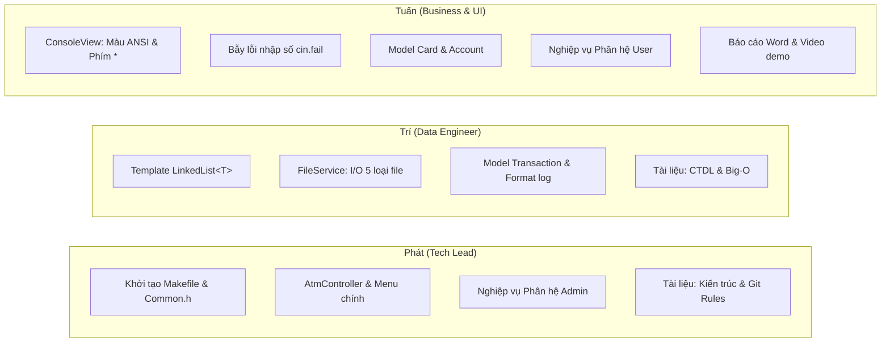

# 06. KẾ HOẠCH TRIỂN KHAI & PHÂN CÔNG NHIỆM VỤ (IMPLEMENTATION PLAN)

Tài liệu này xác định chi tiết kế hoạch thực hiện dự án trong 14 ngày (2 tuần), phân chia công việc theo mô hình Cross-functional cho 3 thành viên nhóm (**Phát**, **Trí**, **Tuấn**), nguyên tắc cộng tác nhóm và quy chuẩn làm việc với Git.

---

## I. MA TRẬN PHÂN CÔNG TRÁCH NHIỆM (RACI MATRIX)

Nhóm gồm 3 thành viên, phân chia trách nhiệm rõ ràng để tránh tình trạng "người làm tất cả, người chỉ làm báo cáo":

### 1. Thành viên: PHÁT (Tech Lead / Core Controller & Admin Flow)
* **Nhiệm vụ Lập trình**:
  * Khởi tạo cấu trúc repository, viết file `.gitignore` và `Makefile` chuẩn `g++ -std=c++17 -Wall -Wextra`.
  * Xây dựng file `include/Common.h` định nghĩa các hằng số, `enum UserRole`, `enum TransactionType`, `enum ErrorCode`.
  * Xây dựng lõi điều phối `AtmController`: Vòng lặp chính, điều hướng menu, quản lý trạng thái phiên đăng nhập.
  * Hiện thực toàn bộ nghiệp vụ Phân hệ Admin: Đăng nhập Admin, Xem danh sách thẻ, Thêm tài khoản mới, Xóa tài khoản, Mở khóa tài khoản bị khóa.
* **Nhiệm vụ Kiểm thử**: Unit test luồng xác thực và thuật toán mở khóa thẻ.
* **Nhiệm vụ Tài liệu**: Soạn thảo tài liệu *Kiến trúc hệ thống* và *Quy chuẩn Git*.

### 2. Thành viên: TRÍ (Data Engineer / Memory & Storage Flow)
* **Nhiệm vụ Lập trình**:
  * Tự cài đặt Cấu trúc dữ liệu Generic Template `LinkedList<T>` và `Node<T>` (không dùng STL).
  * Quản lý bộ nhớ nghiêm ngặt: Viết Destructor thu hồi toàn bộ node, vô hiệu hóa Copy Constructor (`= delete`) để chống lỗi `Double Free`.
  * Cài đặt tầng `FileService`: Đọc/Ghi dữ liệu tĩnh cho `Admin.txt`, `TheTu.txt`, `KhoaThe.txt`, `[ID].txt`, `[LichSuID].txt`.
  * Cài đặt Model `Transaction` và định dạng ghi log lịch sử chuẩn thời gian thực.
* **Nhiệm vụ Kiểm thử**: Sử dụng công cụ **Valgrind** để kiểm tra rò rỉ bộ nhớ (đảm bảo `definitely lost: 0 bytes`).
* **Nhiệm vụ Tài liệu**: Soạn thảo tài liệu *Cấu trúc dữ liệu & Thuật toán*, Bảng phân tích độ phức tạp Big-O.

### 3. Thành viên: TUẤN (Business Logic / User Flow & UI)
* **Nhiệm vụ Lập trình**:
  * Xây dựng module `ConsoleView`: Hiển thị màu sắc ANSI, bẫy lỗi `cin.fail()` cho nhập số tiền, hàm `inputPassword()` ẩn mật khẩu thành dấu `*` và xử lý phím Backspace.
  * Cài đặt các Model `Card` và `Account` kèm các hàm kiểm tra ràng buộc tài chính (rút tối thiểu 50k, bội số 50k, giữ lại tối thiểu 50k).
  * Hiện thực luồng nghiệp vụ Phân hệ User: Đăng nhập người dùng, cơ chế khóa thẻ khi sai 3 lần, ép buộc đổi mã PIN mặc định lần đầu, Rút tiền, Chuyển tiền 2 chiều, Xem thông tin và Đổi mã PIN.
* **Nhiệm vụ Kiểm thử**: Kiểm thử hộp đen toàn bộ các ràng buộc nhập liệu và kịch bản người dùng.
* **Nhiệm vụ Tài liệu & Sản phẩm**: Soạn thảo Báo cáo Word theo mẫu `Mau_BaoCao_DoAn.docx` và quay Video demo thuyết minh đồ án.

---

## II. LỘ TRÌNH 14 NGÀY (GANTT CHART / 4 PHASES)

### Phase 1: Nền tảng, Cấu trúc Dữ liệu & UI cơ sở (Ngày 1 – Ngày 3)
* **Ngày 1**:
  * *Tất cả*: Đồng bộ Git, kiểm tra Makefile trên máy cả 3 thành viên. Thống nhất `Common.h`.
* **Ngày 2 – Ngày 3**:
  * *Phát*: Dựng khung `AtmController`, vòng lặp menu chính, lệnh thoát dọn dẹp bộ nhớ.
  * *Trí*: Viết template `LinkedList<T>` (các hàm `addTail`, `removeIf`, `clear`, destructor).
  * *Tuấn*: Viết `ConsoleView`, hàm `inputPassword()` che dấu `*`, bẫy lỗi `cin.fail()`.
* **Tiêu chí hoàn thành (DoD)**: Toàn bộ code compile sạch sẽ không có warning nào. Test chèn 100 node và gọi `clear()` không rò rỉ bộ nhớ.

---

### Phase 2: Dữ liệu Tệp tin & Phân hệ Admin (Ngày 4 – Ngày 7)
* **Ngày 4 – Ngày 5**:
  * *Trí*: Viết `FileService` đọc dữ liệu `Admin.txt`, `TheTu.txt`, `KhoaThe.txt` vào `LinkedList`.
  * *Tuấn*: Viết Model `Card`, `Account` (getter/setter có `const`, chuẩn Hungarian).
* **Ngày 6 – Ngày 7**:
  * *Phát*: Ráp luồng Admin vào `AtmController`: Đăng nhập, Xem danh sách thẻ, Thêm thẻ (tự sinh 2 file `[ID].txt` và `[LichSuID].txt`), Xóa thẻ, Mở khóa thẻ.
  * *Tuấn*: Thiết kế khung viền giao diện Admin trong `ConsoleView`.
* **Tiêu chí hoàn thành (DoD)**: Admin đăng nhập và thao tác trọn vẹn vòng đời tài khoản. Kiểm tra trong thư mục `data/` có đầy đủ file sinh ra tương ứng.

---

### Phase 3: Phân hệ Khách hàng & Giao dịch Tài chính (Ngày 8 – Ngày 11)
* **Ngày 8 – Ngày 9**:
  * *Phát*: Xử lý luồng đăng nhập User: Đếm số lần sai, khóa thẻ sau 3 lần sai ghi vào `KhoaThe.txt`, ép đổi PIN mặc định `123456`.
  * *Tuấn*: Xử lý luồng Rút tiền (kiểm tra $\ge 50k$, bội số $50k$, giữ lại $50k$).
* **Ngày 10 – Ngày 11**:
  * *Trí & Tuấn (Pair-Programming)*: Thực thi giao dịch Chuyển tiền (đảm bảo tính nguyên tử): Kiểm tra số tài khoản nhận, trừ tiền gửi, cộng tiền nhận, ghi log thời gian thực vào 2 file lịch sử.
* **Tiêu chí hoàn thành (DoD)**: Người dùng thực hiện đầy đủ các giao dịch mà không làm hỏng dữ liệu các file tệp tin.

---

### Phase 4: Kiểm thử, Báo cáo Word & Video Demo (Ngày 12 – Ngày 14)
* **Ngày 12**:
  * *Tất cả*: Kiểm thử chéo (Cross-Testing).
  * *Trí*: Chạy `valgrind --leak-check=full ./bin/atm_app` để đảm bảo 0 byte rò rỉ bộ nhớ.
* **Ngày 13**:
  * *Phát & Trí*: Trích xuất cấu trúc code, vẽ sơ đồ UML lớp, hoàn thiện các mục kỹ thuật trong file Word.
  * *Tuấn*: Chuẩn bị kịch bản demo bao quát toàn bộ 5.0 điểm chức năng.
* **Ngày 14**:
  * *Tuấn*: Quay và biên tập Video báo cáo có thuyết minh rõ ràng.
  * *Tất cả*: Kiểm tra lại lần cuối bộ dữ liệu gốc `data/`, đóng gói mã nguồn và nộp bài.

---

## III. NGUYÊN TẮC PHỐI HỢP NHÓM & QUY CHUẨN GIT

### 1. Ba nguyên tắc phối hợp bất di bất dịch
1. **Blocker Check**: Nếu một thành viên gặp lỗi không thể giải quyết trong quá 4 giờ, phải đưa lên nhóm để 2 thành viên còn lại hỗ trợ giải quyết, không để ảnh hưởng tiến độ chung.
2. **Pull before Push**: Trước khi tạo commit hoặc đẩy code lên remote, luôn phải chạy `git pull` code mới nhất về để giải quyết xung đột cục bộ.
3. **Clean Code Standard**: Nghiêm cấm đặt tên sai chuẩn (như thiếu tiền tố `_`, `str`, `i`), thiếu dấu ngoặc `{}` trong `if/else`, hoặc gọi `new` mà không có `delete`.

### 2. Quy tắc Nhánh (Branching Strategy)
* **Nhánh chính**: `main` (chỉ chứa code đã kiểm thử chạy ổn định).
* **Nhánh cá nhân**:
  * `phat`: Nhánh làm việc của Phát.
  * `tri`: Nhánh làm việc của Trí.
  * `tuan`: Nhánh làm việc của Tuấn.
* **Tiền tố nhánh tính năng khi cần**:
  * `feature/<ten-tinh-nang>`: Thêm tính năng mới (ví dụ: `feature/admin-flow`).
  * `bugfix/<ten-loi>`: Sửa lỗi phát sinh (ví dụ: `bugfix/cin-fail-loop`).

### 3. Quy tắc Viết Commit Message (Tiếng Anh chuẩn)
Nội dung commit phải rõ ràng, bắt đầu bằng tiền tố quy định:
* `feat:` Bổ sung tính năng mới (ví dụ: `feat: implement LinkedList generic template`).
* `fix:` Sửa lỗi logic hoặc ngoại lệ (ví dụ: `fix: resolve cin.fail infinite loop in ConsoleView`).
* `docs:` Cập nhật tài liệu (ví dụ: `docs: update system architecture and Big-O table`).
* `style:` Chỉnh sửa format, khoảng trắng, comment mà không đổi logic (ví dụ: `style: enforce Hungarian notation in Account model`).
* `refactor:` Tái cấu trúc code (ví dụ: `refactor: optimize FileService file streams`).
* `test:` Thêm kịch bản kiểm thử (ví dụ: `test: add unit test for transfer atomicity`).
