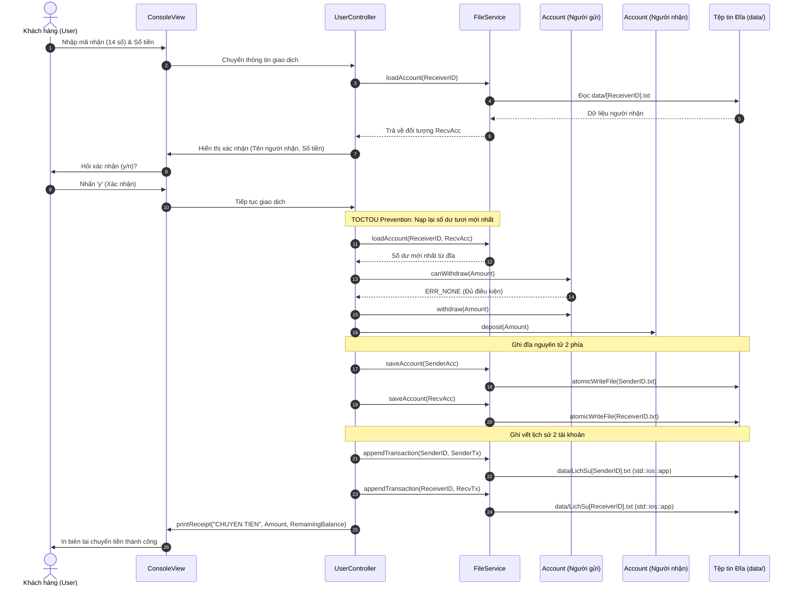

# 07. SƠ ĐỒ UML LỚP VÀ LUỒNG DỮ LIỆU BÁO CÁO (UML & DATA FLOW)

Tài liệu này cung cấp toàn bộ sơ đồ kỹ thuật chuẩn UML (Sơ đồ Lớp, Sơ đồ Phân tầng, Sơ đồ Tuần tự giao dịch) phục vụ trực tiếp cho việc đưa vào Báo cáo Word của đồ án môn học.

---

## I. SƠ ĐỒ LỚP TỔNG THỂ (COMPREHENSIVE UML CLASS DIAGRAM)

```mermaid
classDiagram
    direction TB

    %% Template Cấu trúc dữ liệu
    class Node~T~ {
        +T _data
        +Node~T~* _pNext
        +Node(const T& data)
    }

    class LinkedList~T~ {
        -Node~T~* _pHead
        -Node~T~* _pTail
        -int _iSize
        +LinkedList()
        +~LinkedList()
        +bool isEmpty() const
        +int getSize() const
        +Node~T~* getHead() const
        +Node~T~* getTail() const
        +void addTail(const T& item)
        +T* findIf(Predicate pred)
        +bool removeIf(Predicate pred)
        +void clear()
    }

    Node~T~ --* LinkedList~T~ : Chứa

    %% Tầng Thực thể (Entity Models)
    class Admin {
        -string _strUsername
        -string _strPassword
        +Admin()
        +Admin(string strUser, string strPass)
        +string getUsername() const
        +string getPassword() const
        +bool verifyPassword(string strPass) const
    }

    class Card {
        -string _strId
        -string _strPin
        -int _iFailedAttempts
        -bool _bIsLocked
        +Card()
        +Card(string strId, string strPin)
        +Card(string strId, string strPin, bool bIsLocked)
        +string getId() const
        +string getPin() const
        +bool isLocked() const
        +bool isDefaultPin() const
        +bool checkPin(string strInputPin) const
        +void recordFailedAttempt()
        +void resetFailedAttempts()
        +void unlockCard()
        +void lockCard()
        +void setLocked(bool bLocked)
        +bool changePin(string strNewPin)
        +int getFailedAttempts() const
        +static bool isValidPinFormat(string strPin)
    }

    class Account {
        -string _strId
        -string _strName
        -long _lBalance
        -string _strCurrency
        +Account()
        +Account(string strId, string strName, long lBalance, string strCurrency)
        +string getId() const
        +string getName() const
        +long getBalance() const
        +string getCurrency() const
        +void setName(string strName)
        +void setBalance(long lBalance)
        +void setCurrency(string strCurrency)
        +ErrorCode canWithdraw(long lAmount) const
        +bool withdraw(long lAmount)
        +bool deposit(long lAmount)
    }

    class Transaction {
        -string _strId
        -TransactionType _eType
        -long _lAmount
        -string _strTimestamp
        -string _strDetail
        +Transaction()
        +Transaction(string strId, TransactionType eType, long lAmount, string strTimestamp, string strDetail)
        +string getId() const
        +TransactionType getType() const
        +string getTypeName() const
        +long getAmount() const
        +string getTimestamp() const
        +string getDetail() const
        +string formatForFile() const
        +string toString() const
        +static Transaction parseFromFileLine(string strId, string strLine)
        +static string getCurrentTimestamp()
    }

    %% Tầng Dịch vụ Tệp tin (Persistence Service)
    class FileService {
        +static bool loadAdmins(LinkedList~Admin~& listAdmins)
        +static bool loadCards(LinkedList~Card~& listCards, const LinkedList~string~& listLockedIds)
        +static bool saveCards(const LinkedList~Card~& listCards)
        +static bool loadLockedIds(LinkedList~string~& listLockedIds)
        +static bool saveLockedIds(const LinkedList~string~& listLockedIds)
        +static bool appendLockedCard(string strId)
        +static bool updateCardPin(string strId, string strNewPin)
        +static ErrorCode loadAccount(string strId, Account& acc)
        +static bool saveAccount(const Account& acc)
        +static bool deleteAccountFile(string strId)
        +static bool createAccountFiles(string strId, string strName, long lInitialBalance, string strCurrency)
        +static bool appendTransaction(string strId, const Transaction& trans)
        +static bool loadTransactions(string strId, LinkedList~Transaction~& listTrans)
        +static void initSampleData()
        +static bool appendAdminLog(string strAction, string strDetail)
    }

    %% Tầng Giao diện (Presentation Layer)
    class ConsoleView {
        +static void printHeader(string strTitle)
        +static void printPrompt(string strPrompt)
        +static void printError(string strMsg)
        +static void printSuccess(string strMsg)
        +static void printWarning(string strMsg)
        +static void printInfo(string strMsg)
        +static string inputPassword(string strPrompt, istream* pInStream)
        +static string inputPin(string strPrompt)
        +static long inputMoney(string strPrompt, istream& inStream)
        +static int inputMenuChoice(int iMin, int iMax, string strPrompt, istream& inStream)
        +static string inputLine(string strPrompt)
        +static bool confirmAction(string strPrompt)
        +static void printMainMenu()
        +static void printAdminMenu()
        +static void printUserMenu()
        +static void clearScreen()
        +static void pauseScreen()
        +static void printReceipt(string strId, string strAction, long lAmount, long lRemainingBalance, string strTimestamp, string strCurrency)
        +static void displayAccountDetails(string strId, string strName, long lBalance, string strCurrency)
        +static void displayAccountInfo(const Account& account)
    }

    %% Tầng Điều phối Nghiệp vụ (Controllers)
    class UserController {
        +static bool isValidPinFormat(string strPin)
        +static bool isValidIdFormat(string strId)
        +static bool authenticate(Card& card, string strInputPin, bool& bOutCardLocked)
        +static bool enforceDefaultPinChange(Card& card)
        +static ErrorCode processWithdraw(Account& acc, long lAmount)
        +static ErrorCode processTransfer(Account& senderAcc, Account& receiverAcc, long lAmount)
        +static bool processChangePin(Card& card, string strOldPin, string strNewPin, string strConfirmPin, string& strOutMessage)
        +static void displayAccountInfo(const Account& acc)
        +static void runUserSession(Card& card, Account& acc, Account* pReceiverMock)
    }

    class AdminController {
        -LinkedList~Admin~ _listAdmins
        -LinkedList~Card~ _listCards
        -LinkedList~string~ _listLockedIds
        +AdminController()
        +bool loadAllData()
        +bool verifyAdmin(string strUser, string strPass) const
        +void viewCardList() const
        +void addNewCard()
        +void deleteCard()
        +void unlockCard()
        +void processAdminMenu()
    }

    class AtmController {
        -LinkedList~Admin~ _listAdmins
        -LinkedList~Card~ _listCards
        -LinkedList~string~ _listLockedIds
        -Account* _pCurrentAccount
        -Card* _pCurrentCard
        -UserRole _eCurrentRole
        +AtmController()
        +~AtmController()
        +bool initData()
        +void run()
        +void cleanupSession()
        +bool authenticateAdmin(string strUser, string strPass) const
        +void processAdminLogin()
        +void processAdminMenu()
        +void adminViewCards()
        +ErrorCode addCardAccount(string strId, string strName, long lInitialBalance, string strCurrency)
        +void adminAddCard()
        +ErrorCode deleteCardAccount(string strId)
        +void adminDeleteCard()
        +ErrorCode unlockCardAccount(string strId)
        +void adminUnlockCard()
        +void processUserLogin()
        +void processUserMenu()
    }

    %% Mối quan hệ giữa các lớp
    AtmController o-- LinkedList~Admin~
    AtmController o-- LinkedList~Card~
    AtmController o-- LinkedList~string~
    AtmController o-- Account
    AtmController o-- Card
    AtmController ..> UserController : Sử dụng
    AtmController ..> AdminController : Tích hợp
    AtmController ..> FileService : I/O Tệp
    AtmController ..> ConsoleView : Giao diện

    AdminController o-- LinkedList~Admin~
    AdminController o-- LinkedList~Card~
    AdminController o-- LinkedList~string~
    AdminController ..> FileService : I/O Tệp
    AdminController ..> ConsoleView : Giao diện

    UserController ..> Account : Biến đổi số dư
    UserController ..> Card : Đổi PIN / Khóa
    UserController ..> FileService : Lưu tức thì
    UserController ..> ConsoleView : Giao diện
```



---

## II. SƠ ĐỒ LUỒNG DỮ LIỆU TỔNG THỂ (SYSTEM DATA FLOW DIAGRAM - DFD)

```mermaid
flowchart TD
    User([Khách hàng / Admin])

    subgraph UI ["Tầng Giao Diện (ConsoleView)"]
        CV[ConsoleView<br>• Hiển thị menu ANSI<br>• Bắt phím ẩn mã PIN *<br>• Bẫy lỗi nhập số cin.fail]
    end

    subgraph Controller ["Tầng Điều Phối (Controllers)"]
        ATM[AtmController<br>• Quản lý phiên làm việc<br>• Điều phối vòng lặp chính]
        UC[UserController<br>• Rút tiền<br>• Chuyển tiền nguyên tử<br>• Đổi mã PIN]
        AC[AdminController<br>• Xem DS thẻ<br>• Thêm thẻ 2 file<br>• Xóa thẻ & Cảnh báo<br>• Mở khóa thẻ]
    end

    subgraph Memory ["Tầng RAM (LinkedList & Entities)"]
        RAM_Cards[LinkedList&lt;Card&gt;]
        RAM_Locked[LinkedList&lt;string&gt;]
        RAM_Admins[LinkedList&lt;Admin&gt;]
        RAM_Acc[Account Hiện Tại]
    end

    subgraph Service ["Tầng Dịch Vụ Lưu Trữ (FileService)"]
        FS[FileService<br>• atomicWriteFile có .bak<br>• Đọc 4 dòng getline có space<br>• Ghi log appending std::ios::app]
    end

    subgraph Disk ["Tầng Tệp Vật Lý (data/)"]
        F_Admin[(Admin.txt)]
        F_TheTu[(TheTu.txt)]
        F_KhoaThe[(KhoaThe.txt)]
        F_Acc[([ID].txt)]
        F_History[(LichSu[ID].txt)]
        F_Log[(AdminLog.txt)]
    end

    User <-->|Nhập lệnh / Xem kết quả| CV
    CV <-->|Điều hướng| ATM
    ATM -->|Phân quyền User| UC
    ATM -->|Phân quyền Admin| AC

    ATM <-->|Duyệt & Quản lý RAM| RAM_Cards
    ATM <-->|Quản lý thẻ khóa| RAM_Locked
    ATM <-->|Xác thực Admin| RAM_Admins
    UC <-->|Thao tác số dư| RAM_Acc

    UC -->|Ghi đĩa ngay khi giao dịch| FS
    AC -->|Cập nhật danh sách & Thẻ| FS
    ATM -->|Khởi tạo & Nạp dữ liệu| FS

    FS <-->|I/O Admin| F_Admin
    FS <-->|I/O Danh sách thẻ| F_TheTu
    FS <-->|I/O Thẻ bị khóa| F_KhoaThe
    FS <-->|I/O Tài khoản| F_Acc
    FS -->|Ghi nối lịch sử| F_History
    FS -->|Ghi nhật ký kiểm toán| F_Log
```

---

## III. SƠ ĐỒ TUẦN TỰ: GIAO DỊCH CHUYỂN TIỀN NGUYÊN TỬ (TRANSFER SEQUENCE)


