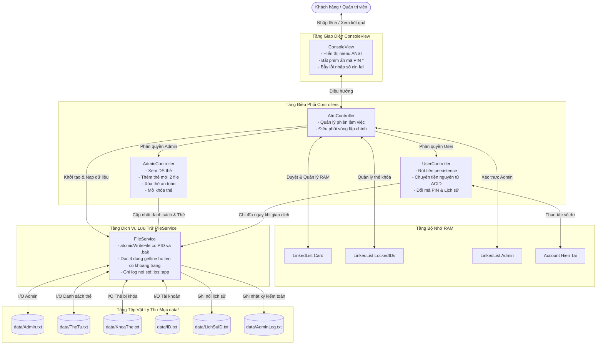
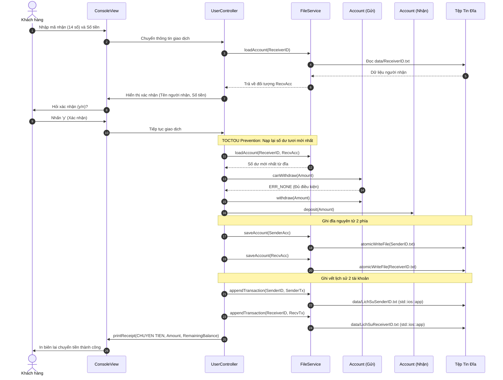

# 08. SƠ ĐỒ UML LỚP VÀ LUỒNG DỮ LIỆU BÁO CÁO (UML & DATA FLOW)

---

## I. SƠ ĐỒ LỚP TỔNG THỂ (COMPREHENSIVE UML CLASS DIAGRAM)

```mermaid
classDiagram
    direction TB

    %% Template Cấu trúc dữ liệu
    class Node {
        +T _data
        +Node* _pNext
        +Node(data)
    }

    class LinkedList {
        -Node* _pHead
        -Node* _pTail
        -int _iSize
        +LinkedList()
        +destruct()
        +isEmpty() bool
        +getSize() int
        +getHead() Node*
        +getTail() Node*
        +addTail(item) void
        +findIf(pred) T*
        +removeIf(pred) bool
        +clear() void
    }

    Node --* LinkedList : Chứa

    %% Tầng Thực thể (Entity Models)
    class Admin {
        -string _strUsername
        -string _strPassword
        +Admin()
        +Admin(strUser, strPass)
        +getUsername() string
        +getPassword() string
        +verifyPassword(strPass) bool
    }

    class Card {
        -string _strId
        -string _strPin
        -int _iFailedAttempts
        -bool _bIsLocked
        +Card()
        +Card(strId, strPin)
        +Card(strId, strPin, bIsLocked)
        +getId() string
        +getPin() string
        +isLocked() bool
        +isDefaultPin() bool
        +checkPin(strInputPin) bool
        +recordFailedAttempt() void
        +resetFailedAttempts() void
        +unlockCard() void
        +lockCard() void
        +setLocked(bLocked) void
        +changePin(strNewPin) bool
        +getFailedAttempts() int
        +isValidPinFormat(strPin)$ bool
    }

    class Account {
        -string _strId
        -string _strName
        -long _lBalance
        -string _strCurrency
        +Account()
        +Account(strId, strName, lBalance, strCurrency)
        +getId() string
        +getName() string
        +getBalance() long
        +getCurrency() string
        +setName(strName) void
        +setBalance(lBalance) void
        +setCurrency(strCurrency) void
        +canWithdraw(lAmount) ErrorCode
        +withdraw(lAmount) bool
        +deposit(lAmount) bool
    }

    class Transaction {
        -string _strId
        -TransactionType _eType
        -long _lAmount
        -string _strTimestamp
        -string _strDetail
        +Transaction()
        +Transaction(strId, eType, lAmount, strTimestamp, strDetail)
        +getId() string
        +getType() TransactionType
        +getTypeName() string
        +getAmount() long
        +getTimestamp() string
        +getDetail() string
        +formatForFile() string
        +toString() string
        +parseFromFileLine(strId, strLine)$ Transaction
        +getCurrentTimestamp()$ string
    }

    %% Tầng Dịch vụ Tệp tin (Persistence Service)
    class FileService {
        +loadAdmins(listAdmins)$ bool
        +loadCards(listCards, listLockedIds)$ bool
        +saveCards(listCards)$ bool
        +loadLockedIds(listLockedIds)$ bool
        +saveLockedIds(listLockedIds)$ bool
        +appendLockedCard(strId)$ bool
        +updateCardPin(strId, strNewPin)$ bool
        +loadAccount(strId, acc)$ ErrorCode
        +saveAccount(acc)$ bool
        +deleteAccountFile(strId)$ bool
        +createAccountFiles(strId, strName, lBalance, strCurrency)$ bool
        +appendTransaction(strId, trans)$ bool
        +loadTransactions(strId, listTrans)$ bool
        +initSampleData()$ void
        +appendAdminLog(strAction, strDetail)$ bool
    }

    %% Tầng Giao diện (Presentation Layer)
    class ConsoleView {
        +printHeader(strTitle)$ void
        +printPrompt(strPrompt)$ void
        +printError(strMsg)$ void
        +printSuccess(strMsg)$ void
        +printWarning(strMsg)$ void
        +printInfo(strMsg)$ void
        +inputPassword(strPrompt, pInStream)$ string
        +inputPin(strPrompt)$ string
        +inputMoney(strPrompt, inStream)$ long
        +inputMenuChoice(iMin, iMax, strPrompt, inStream)$ int
        +inputLine(strPrompt)$ string
        +confirmAction(strPrompt)$ bool
        +printMainMenu()$ void
        +printAdminMenu()$ void
        +printUserMenu()$ void
        +clearScreen()$ void
        +pauseScreen()$ void
        +printReceipt(strId, strAction, lAmount, lRemBalance, strTime, strCurrency)$ void
        +displayAccountDetails(strId, strName, lBalance, strCurrency)$ void
        +displayAccountInfo(account)$ void
    }

    %% Tầng Điều phối Nghiệp vụ (Controllers)
    class UserController {
        +isValidPinFormat(strPin)$ bool
        +isValidIdFormat(strId)$ bool
        +authenticate(card, strInputPin, bOutCardLocked)$ bool
        +enforceDefaultPinChange(card)$ bool
        +processWithdraw(acc, lAmount)$ ErrorCode
        +processWithdrawAndPersist(acc, lAmount, bOutCardFailed)$ ErrorCode
        +processTransfer(senderAcc, receiverAcc, lAmount)$ ErrorCode
        +processTransferAndPersist(senderAcc, strReceiverId, lAmount, strCurrency)$ ErrorCode
        +processChangePin(card, strOldPin, strNewPin, strConfirmPin, strOutMsg)$ bool
        +processChangePinAndPersist(card, strNewPin)$ bool
        +displayTransactionHistory(strId, bPause)$ bool
        +displayAccountInfo(acc)$ void
        +runUserSession(card, acc, pReceiverMock)$ void
    }

    class AdminController {
        -LinkedList _listAdmins
        -LinkedList _listCards
        -LinkedList _listLockedIds
        +AdminController()
        +loadAllData() bool
        +verifyAdmin(strUser, strPass) bool
        +viewCardList() void
        +addNewCard() void
        +deleteCard() void
        +unlockCard() void
        +processAdminLogin() bool
        +processAdminMenu() void
    }

    class AtmController {
        -LinkedList _listAdmins
        -LinkedList _listCards
        -LinkedList _listLockedIds
        -Account* _pCurrentAccount
        -Card* _pCurrentCard
        -UserRole _eCurrentRole
        +AtmController()
        +destruct()
        +initData() bool
        +run() void
        +cleanupSession() void
        +authenticateAdmin(strUser, strPass) bool
        +processAdminLogin() void
        +processAdminMenu() void
        +adminViewCards() void
        +addCardAccount(strId, strName, lBalance, strCurrency) ErrorCode
        +adminAddCard() void
        +deleteCardAccount(strId) ErrorCode
        +adminDeleteCard() void
        +unlockCardAccount(strId) ErrorCode
        +adminUnlockCard() void
        +processUserLogin() void
        +processUserMenu() void
    }

    %% Mối quan hệ giữa các lớp
    AtmController o-- LinkedList : Chứa danh sách
    AtmController o-- Account : Quản lý phiên
    AtmController o-- Card : Quản lý phiên
    AtmController ..> UserController : Điều hướng User
    AtmController ..> AdminController : Tích hợp Admin
    AtmController ..> FileService : Nạp dữ liệu
    AtmController ..> ConsoleView : Hiển thị Menu

    AdminController o-- LinkedList : Chứa danh sách
    AdminController ..> FileService : Đọc ghi tệp
    AdminController ..> ConsoleView : Giao diện Admin

    UserController ..> Account : Biến đổi số dư
    UserController ..> Card : Đổi PIN hoặc Khóa
    UserController ..> FileService : Lưu tức thì
    UserController ..> ConsoleView : Giao diện User
```

---

## II. SƠ ĐỒ LUỒNG DỮ LIỆU TỔNG THỂ (SYSTEM DATA FLOW DIAGRAM - DFD)

---

## III. SƠ ĐỒ TUẦN TỰ: GIAO DỊCH CHUYỂN TIỀN NGUYÊN TỬ (TRANSFER SEQUENCE)

