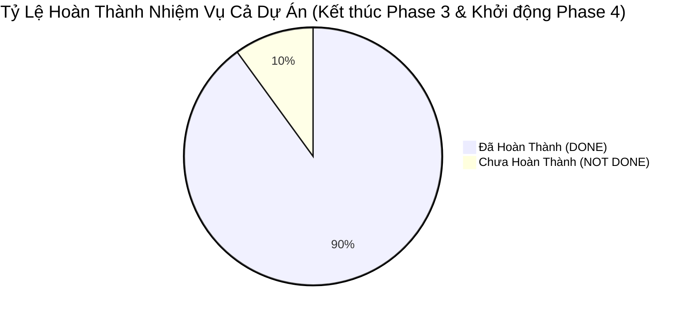
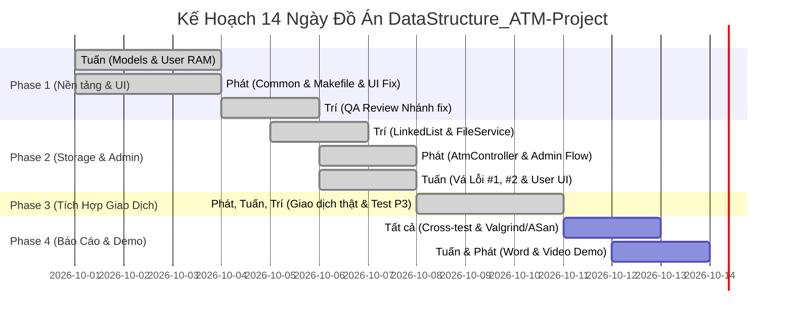

# 📋 BẢNG THEO DÕI TIẾN ĐỘ CÔNG VIỆC DỰ ÁN (PROJECT TASK TRACKER)
> **Dự án:** `DataStructure_ATM-Project` (Mô phỏng hệ thống ATM bằng C++)  
> **Cập nhật lần cuối:** 08/10/2026 (Hoàn tất Phase 3 - Toàn bộ mã nguồn & kiểm thử đã xong)  
> **Quy chuẩn đánh giá trạng thái:** `DONE` (Đã hoàn thành) | `NOT DONE` (Chưa hoàn thành)

---

## 📊 I. TỔNG QUAN TIẾN ĐỘ TOÀN DỰ ÁN (DASHBOARD)

| Thành viên | Vai trò phụ trách | Tổng việc | Đã xong (DONE) | Còn lại (NOT DONE) | Tiến độ (%) |
| :--- | :--- | :---: | :---: | :---: | :---: |
| **TRÍ (Thành viên B)** | Data Engineer / Memory & Storage Flow | 12 | **11** | **1** | **91.7%** |
| **TUẤN (Thành viên A)** | Business Logic / User Flow & UI | 13 | **11** | **2** | **84.6%** |
| **PHÁT (Thành viên C)** | Tech Lead / Core Controller & Admin Flow | 15 | **14** | **1** | **93.3%** |
| **TỔNG CỘNG** | **Toàn đội ngũ 3 thành viên** | **40** | **36** | **4** | **90.0%** |

---

## 👤 II. CHI TIẾT CÔNG VIỆC TỪNG THÀNH VIÊN

---

### 1. THÀNH VIÊN B: TRÍ (Data Engineer / Memory & Storage Flow)
> **Trách nhiệm chính:** Cấu trúc dữ liệu tự tạo `LinkedList<T>`, quản lý bộ nhớ không rò rỉ, tầng tệp tin `FileService` đọc/ghi 5 file vật lý, Model `Transaction`.

| STT | Giai đoạn (Phase) | Hạng mục công việc | Mô tả chi tiết | File liên quan | Trạng thái |
| :---: | :---: | :--- | :--- | :--- | :---: |
| **B01** | Phase 1 | Cài đặt Generic Template `LinkedList<T>` | Tự viết danh sách liên kết đơn (không dùng STL), quản lý con trỏ `_pHead`, `_pTail` để thêm cuối $\mathcal{O}(1)$. | `include/LinkedList.h` | **`DONE`** |
| **B02** | Phase 1 | Các phương thức cơ bản của `LinkedList` | Hiện thực `addTail`, `removeIf`, `findIf`, `clear`, `getSize`, `isEmpty`, `getHead`. | `include/LinkedList.h` | **`DONE`** |
| **B03** | Phase 1 | Cơ chế an toàn bộ nhớ cho `LinkedList` | Thu hồi 100% node trong Destructor (`~LinkedList`); vô hiệu hóa copy semantics (`= delete`) chống lỗi Double Free. | `include/LinkedList.h` | **`DONE`** |
| **B04** | Phase 2 | Cài đặt Model `Admin` | Lưu trữ username/password ban quản trị, hàm `verifyPassword()`. | `include/Admin.h` `src/Admin.cpp` | **`DONE`** |
| **B05** | Phase 2 | Cài đặt Model `Transaction` | Quản lý lịch sử giao dịch; hàm `formatForFile()`, `parseFromFileLine()`, `getCurrentTimestamp()`. | `include/Transaction.h` `src/Transaction.cpp` | **`DONE`** |
| **B06** | Phase 2 | Tầng `FileService`: I/O Thẻ từ & Admin | Đọc/Ghi dữ liệu cho `data/Admin.txt`, `data/TheTu.txt`, `data/KhoaThe.txt`. | `include/FileService.h` `src/FileService.cpp` | **`DONE`** |
| **B07** | Phase 2 | Tầng `FileService`: I/O Tài khoản cá nhân | Đọc/Ghi/Xóa file `data/[ID].txt`; bẫy lỗi đọc họ tên có khoảng trắng bằng `std::getline()`. | `include/FileService.h` `src/FileService.cpp` | **`DONE`** |
| **B08** | Phase 2 | Tầng `FileService`: Ghi log giao dịch | Ghi nối thời gian thực vào `data/LichSu[ID].txt` (cờ `std::ios::app`) và đọc danh sách lịch sử. | `include/FileService.h` `src/FileService.cpp` | **`DONE`** |
| **B09** | Phase 2 | Cơ chế Auto-Recovery dữ liệu mẫu | Tự động tạo thư mục `data/` và sinh sẵn 3 Admin, 10 Thẻ từ cùng 10 file tài khoản mẫu nếu chưa có. | `src/FileService.cpp` | **`DONE`** |
| **B10** | Phase 3 | Hỗ trợ ghép nối Chuyển tiền nguyên tử | Pair-programming cùng Tuấn kết nối `FileService::loadAccount` vào luồng chuyển tiền 2 đầu. | `src/UserController.cpp` | **`DONE`** |
| **B11** | Phase 4 | Kiểm thử rò rỉ bộ nhớ Valgrind / ASan | Chạy Valgrind / ASan kiểm tra ứng dụng hoàn chỉnh, đảm bảo `definitely lost: 0 bytes`. | `Makefile` `test/` | **`DONE`** |
| **B12** | Phase 4 | Tài liệu Báo cáo: CTDL & Big-O | Soạn thảo mục phân tích cấu trúc dữ liệu, so sánh ưu nhược điểm và bảng độ phức tạp Big-O cho file Word. | Báo cáo Word | **`NOT DONE`** |

---

### 2. THÀNH VIÊN A: TUẤN (Business Logic / User Flow & UI)
> **Trách nhiệm chính:** Tầng thực thể `Card`, `Account`, giao diện `ConsoleView`, nghiệp vụ Phân hệ Khách hàng (`UserController`), Báo cáo Word & Video Demo.

| STT | Giai đoạn (Phase) | Hạng mục công việc | Mô tả chi tiết | File liên quan | Trạng thái |
| :---: | :---: | :--- | :--- | :--- | :---: |
| **A01** | Phase 1 | Cài đặt Model `Card` | Thực thể thẻ từ: `_strId`, `_strPin`, `_bIsLocked`, đếm sai `_iFailedAttempts`, kiểm tra mã PIN 6 số. | `include/Card.h` `src/Card.cpp` | **`DONE`** |
| **A02** | Phase 1 | Cài đặt Model `Account` | Thực thể tài khoản: `_lBalance` (kiểu long), `canWithdraw()` bẫy 3 ràng buộc (tối thiểu 50k, bội số 50k, giữ lại 50k). | `include/Account.h` `src/Account.cpp` | **`DONE`** |
| **A03** | Phase 1 | Tầng `ConsoleView` cơ bản | Mã màu ANSI, bẫy lỗi `cin.fail()` khi nhập tiền, hàm `inputPassword()` che dấu `*` và xử lý Backspace. | `include/ConsoleView.h` `src/ConsoleView.cpp` | **`DONE`** |
| **A04** | Phase 1 | Giao diện Menu & Biên lai | Khung viền ASCII, `printUserMenu()`, `printReceipt()` in hóa đơn giao dịch. | `include/ConsoleView.h` `src/ConsoleView.cpp` | **`DONE`** |
| **A05** | Phase 1 | Nghiệp vụ `UserController` trong RAM | Đăng nhập, đếm sai 3 lần để khóa thẻ trong RAM, ép đổi PIN mặc định `123456`, đổi PIN chủ động. | `include/UserController.h` `src/UserController.cpp` | **`DONE`** |
| **A06** | Phase 1 | Chuyển tiền nguyên tử In-memory | Triển khai `processTransfer()` có cơ chế Rollback hoàn tiền khi tài khoản nhận bị lỗi nạp tiền. | `src/UserController.cpp` | **`DONE`** |
| **A07** | Phase 1 | Unit test Phân hệ User | Viết bộ kiểm thử ban đầu cho các hàm logic của User module. | `test/test_member_a.cpp` | **`DONE`** |
| **A08** | Phase 2 | Vá Lỗi #1: Bỏ trừ tiền ảo khi chuyển khoản | Thay thế nhánh mock tự ý `withdraw()` bằng kiểm tra tài khoản nhận thật qua `FileService::loadAccount()`. | `src/UserController.cpp` | **`DONE`** |
| **A09** | Phase 2 | Vá Lỗi #2: Format thời gian biên lai | Thay thế chuỗi cứng `"Realtime"` bằng chuỗi thời gian thực lấy từ `Transaction::getCurrentTimestamp()`. | `src/UserController.cpp` | **`DONE`** |
| **A10** | Phase 3 | Kết nối FileService vào Rút tiền | Cập nhật số dư vào file `[ID].txt` và ghi vết giao dịch vào `LichSu[ID].txt` sau khi rút tiền thành công. | `src/UserController.cpp` | **`DONE`** |
| **A11** | Phase 3 | Kết nối FileService vào Đổi PIN & Xem LS | Lưu mã PIN mới vào `TheTu.txt`; nạp và in bảng lịch sử giao dịch từ `LichSu[ID].txt`. | `src/UserController.cpp` | **`DONE`** |
| **A12** | Phase 4 | Soạn thảo Báo cáo Word | Hoàn thiện toàn bộ nội dung đồ án theo mẫu `Mau_BaoCao_DoAn.docx` của nhà trường. | `Project/Mau_BaoCao_DoAn.docx` | **`NOT DONE`** |
| **A13** | Phase 4 | Quay & Biên tập Video Demo | Quay video thuyết minh chạy thực tế đầy đủ kịch bản Admin và User (tối thiểu 5.0 điểm chức năng). | Video MP4 | **`NOT DONE`** |

---

### 3. THÀNH VIÊN C: PHÁT (Tech Lead / Core Controller & Admin Flow)
> **Trách nhiệm chính:** Kiến trúc chung, `Common.h`, Makefile, bảo mật I/O Terminal, bộ điều phối trung tâm `AtmController`, Phân hệ Quản trị Admin, `main.cpp`.

| STT | Giai đoạn (Phase) | Hạng mục công việc | Mô tả chi tiết | File liên quan | Trạng thái |
| :---: | :---: | :--- | :--- | :--- | :---: |
| **C01** | Phase 1 | Khởi tạo Cấu trúc Repo & Build Script | Thiết lập thư mục, file `.gitignore`, viết `Makefile` chuẩn `g++ -std=c++17 -Wall -Wextra`. | `Makefile` `.gitignore` | **`DONE`** |
| **C02** | Phase 1 | Định nghĩa Hệ thống dùng chung | Khai báo hằng số hệ thống, enum `TransactionType`, `UserRole`, `ErrorCode` (chuẩn C++17 `inline`). | `include/Common.h` | **`DONE`** |
| **C03** | Phase 1 | Nâng cấp Bảo mật `ConsoleView` | Lớp RAII `LinuxTerminalRawGuard`, drain sạch chuỗi thoát ANSI (phím mũi tên), xử lý EOF chống loop 100% CPU. | `src/ConsoleView.cpp` | **`DONE`** |
| **C04** | Phase 1 | Gia cố tính toàn vẹn của Model | Bổ sung kiểm tra định dạng tĩnh `isValidPinFormat()`, chặn nạp tiền âm/tràn số nguyên trong `Account`. | `src/Card.cpp` `src/Account.cpp` | **`DONE`** |
| **C05** | Phase 1 | Unit test I/O Streams tự động | Viết test bẫy lỗi Stream I/O bằng `std::istringstream` không cần người dùng gõ tay. | `test/test_member_c.cpp` | **`DONE`** |
| **C06** | Phase 1 | Soạn thảo Tài liệu Kiến trúc | Viết tài liệu Kiến trúc hệ thống 5 tầng và quy chuẩn phối hợp nhóm trên Git. | `docs/03_kien_truc_he_thong.md` `docs/06_ke_hoach_trien_khai.md` | **`DONE`** |
| **C07** | Phase 1 | Hợp nhất nhánh `fix` | Giải quyết xung đột git khi merge code của Member A và Member C vào nhánh `fix`. | Git branch `fix` | **`DONE`** |
| **C08** | Phase 2 | Thêm hàm lấy thời gian hệ thống | Bổ sung hàm tiện ích `inline std::string getNowTimestamp()` trong `Common.h`. | `include/Common.h` | **`DONE`** |
| **C09** | Phase 2 | Xây dựng Bộ điều phối `AtmController` | Khai báo lớp `AtmController`, quản lý trạng thái phiên làm việc (`_pCurrentAccount`, `_pCurrentCard`, `_eCurrentRole`). | `include/AtmController.h` | **`DONE`** |
| **C10** | Phase 2 | Hiện thực Vòng lặp Menu chính | Vòng lặp ứng dụng: Điều hướng Menu Đăng nhập Admin, Đăng nhập User, Thoát chương trình dọn RAM. | `src/AtmController.cpp` | **`DONE`** |
| **C11** | Phase 2 | Hiện thực Phân hệ Quản trị Admin | 4 chức năng: Xem danh sách thẻ, Thêm thẻ (sinh 2 file), Xóa thẻ (xóa file ID), Mở khóa thẻ bị khóa. | `src/AtmController.cpp` | **`DONE`** |
| **C12** | Phase 2 | Điểm vào chính `src/main.cpp` | Viết `main()` gọi `FileService::initSampleData()` và kích hoạt `AtmController::run()`. | `src/main.cpp` | **`DONE`** |
| **C14** | Phase 2 | Gia cố An toàn & Độ bền Dữ liệu | Cơ chế Atomic File Write, Anti-Leak Archive, Input Sanitization, Rate-Limiting chống Brute-Force. | `src/FileService.cpp` `src/AtmController.cpp` | **`DONE`** |
| **C15** | Phase 2 | Hoàn thiện tiêu chuẩn Production | Menu số nghiêm ngặt, Phân trang sao kê, Admin Audit Log, Cảnh báo xóa thẻ có số dư, Non-tty fallback. | `src/ConsoleView.cpp` `src/UserController.cpp` `test/test_phase_2_c.cpp` | **`DONE`** |
| **C16** | Phase 3 | Gia cố Luồng Đăng nhập & Thoát an toàn | Bổ sung bẫy hủy đăng nhập an toàn bằng phím Enter hoặc 0 khi nhập ID và PIN không phạt số lần sai; khóa thẻ vào `KhoaThe.txt`. | `src/AtmController.cpp` | **`DONE`** |
| **C17** | Phase 3 | Bộ Kiểm thử Tự động Tích hợp Phase 3 | Xây dựng bộ test `test/test_phase_3.cpp` (58 test cases) và target `make test_phase_3` bao quát 100% luồng User & giao dịch tài chính. | `test/test_phase_3.cpp` `Makefile` | **`DONE`** |
| **C13** | Phase 4 | Hoàn thiện Sơ đồ Kỹ thuật Báo cáo | Vẽ sơ đồ UML Lớp hoàn chỉnh và sơ đồ luồng dữ liệu kiến trúc đưa vào Báo cáo Word. | Báo cáo Word | **`NOT DONE`** |

---

## 📅 III. CÁC CỘT MỐC CHUYỂN GIAO TIẾP THEO (NEXT MILESTONES)

